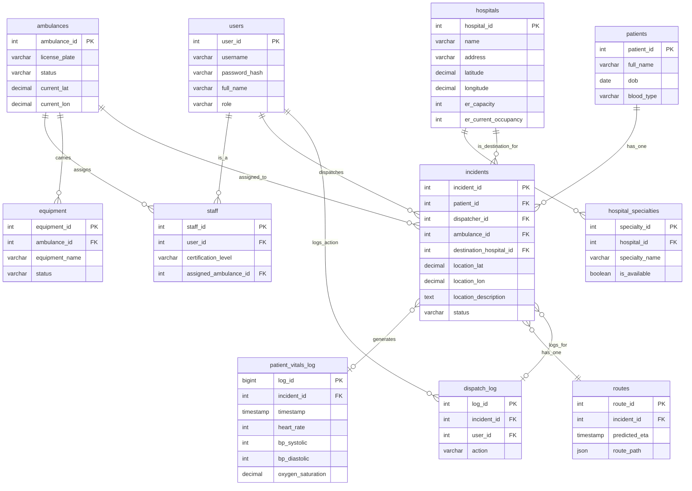

```mermaid
erDiagram
    users {
        int user_id PK
        varchar username
        varchar password_hash
        varchar full_name
        varchar role
    }
    staff {
        int staff_id PK
        int user_id FK
        varchar certification_level
        int assigned_ambulance_id FK
    }
    ambulances {
        int ambulance_id PK
        varchar license_plate
        varchar status
        decimal current_lat
        decimal current_lon
    }
    equipment {
        int equipment_id PK
        int ambulance_id FK
        varchar equipment_name
        varchar status
    }
    hospitals {
        int hospital_id PK
        varchar name
        varchar address
        decimal latitude
        decimal longitude
        int er_capacity
        int er_current_occupancy
    }
    hospital_specialties {
        int specialty_id PK
        int hospital_id FK
        varchar specialty_name
        boolean is_available
    }
    patients {
        int patient_id PK
        varchar full_name
        date dob
        varchar blood_type
    }
    incidents {
        int incident_id PK
        int patient_id FK
        int dispatcher_id FK
        int ambulance_id FK
        int destination_hospital_id FK
        decimal location_lat
        decimal location_lon
        text location_description
        varchar status
    }
    patient_vitals_log {
        bigint log_id PK
        int incident_id FK
        timestamp timestamp
        int heart_rate
        int bp_systolic
        int bp_diastolic
        decimal oxygen_saturation
    }
    routes {
        int route_id PK
        int incident_id FK
        timestamp predicted_eta
        json route_path
    }
    dispatch_log {
        int log_id PK
        int incident_id FK
        int user_id FK
        varchar action
    }

    users ||--o{ staff : "is_a"
    users ||--o{ incidents : "dispatches"
    users ||--o{ dispatch_log : "logs_action"
    ambulances ||--o{ staff : "assigns"
    ambulances ||--o{ equipment : "carries"
    ambulances ||--o{ incidents : "assigned_to"
    hospitals ||--o{ hospital_specialties : "has"
    hospitals ||--o{ incidents : "is_destination_for"
    patients ||--o{ incidents : "has_one"
    incidents }o--o| patient_vitals_log : "generates"
    incidents }o--|| routes : "has_one"
    incidents }o--o| dispatch_log : "logs_for"
```