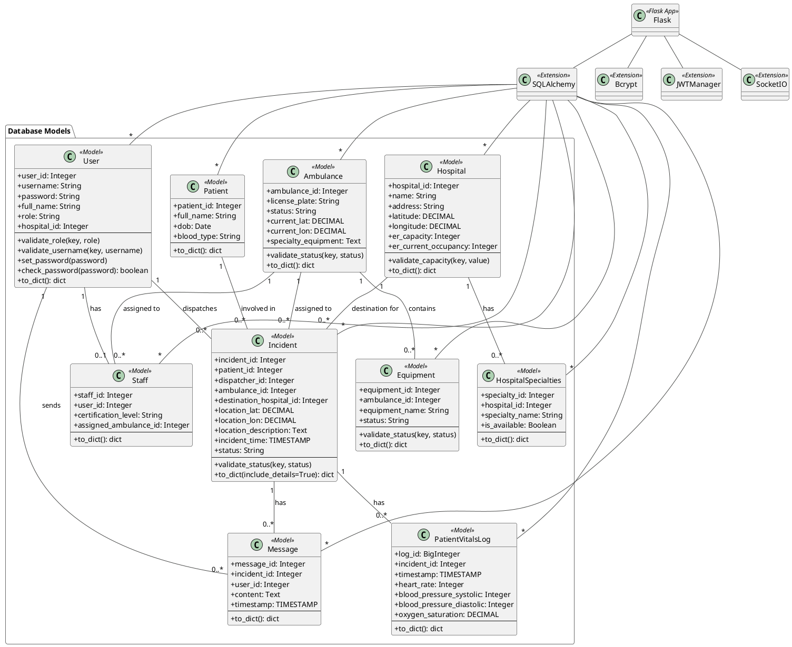

```plantuml
@startuml
!theme vibrant
skinparam classAttributeIconSize 0

' Core Application and Extensions
class Flask <<Flask App>>
class SQLAlchemy <<Extension>>
class Bcrypt <<Extension>>
class JWTManager <<Extension>>
class SocketIO <<Extension>>

Flask -- SQLAlchemy
Flask -- Bcrypt
Flask -- JWTManager
Flask -- SocketIO

' Model Classes
package "Database Models" {
  class User <<Model>> {
    + user_id: Integer
    + username: String
    + password: String
    + full_name: String
    + role: String
    + hospital_id: Integer
    --
    + validate_role(key, role)
    + validate_username(key, username)
    + set_password(password)
    + check_password(password): boolean
    + to_dict(): dict
  }

  class Staff <<Model>> {
    + staff_id: Integer
    + user_id: Integer
    + certification_level: String
    + assigned_ambulance_id: Integer
    --
    + to_dict(): dict
  }

  class Ambulance <<Model>> {
    + ambulance_id: Integer
    + license_plate: String
    + status: String
    + current_lat: DECIMAL
    + current_lon: DECIMAL
    + specialty_equipment: Text
    --
    + validate_status(key, status)
    + to_dict(): dict
  }

  class Equipment <<Model>> {
    + equipment_id: Integer
    + ambulance_id: Integer
    + equipment_name: String
    + status: String
    --
    + validate_status(key, status)
    + to_dict(): dict
  }

  class Hospital <<Model>> {
    + hospital_id: Integer
    + name: String
    + address: String
    + latitude: DECIMAL
    + longitude: DECIMAL
    + er_capacity: Integer
    + er_current_occupancy: Integer
    --
    + validate_capacity(key, value)
    + to_dict(): dict
  }

  class HospitalSpecialties <<Model>> {
    + specialty_id: Integer
    + hospital_id: Integer
    + specialty_name: String
    + is_available: Boolean
    --
    + to_dict(): dict
  }

  class Patient <<Model>> {
    + patient_id: Integer
    + full_name: String
    + dob: Date
    + blood_type: String
    --
    + to_dict(): dict
  }

  class Incident <<Model>> {
    + incident_id: Integer
    + patient_id: Integer
    + dispatcher_id: Integer
    + ambulance_id: Integer
    + destination_hospital_id: Integer
    + location_lat: DECIMAL
    + location_lon: DECIMAL
    + location_description: Text
    + incident_time: TIMESTAMP
    + status: String
    --
    + validate_status(key, status)
    + to_dict(include_details=True): dict
  }

  class PatientVitalsLog <<Model>> {
    + log_id: BigInteger
    + incident_id: Integer
    + timestamp: TIMESTAMP
    + heart_rate: Integer
    + blood_pressure_systolic: Integer
    + blood_pressure_diastolic: Integer
    + oxygen_saturation: DECIMAL
    --
    + to_dict(): dict
  }

  class Message <<Model>> {
    + message_id: Integer
    + incident_id: Integer
    + user_id: Integer
    + content: Text
    + timestamp: TIMESTAMP
    --
    + to_dict(): dict
  }
}

' Relationships between Models
User "1" -- "0..1" Staff : has
Ambulance "1" -- "0..*" Staff : assigned to
Ambulance "1" -- "0..*" Equipment : contains
Hospital "1" -- "0..*" HospitalSpecialties : has
User "1" -- "0..*" Incident : dispatches
Patient "1" -- "0..*" Incident : involved in
Ambulance "1" -- "0..*" Incident : assigned to
Hospital "1" -- "0..*" Incident : destination for
Incident "1" -- "0..*" PatientVitalsLog : has
Incident "1" -- "0..*" Message : has
User "1" -- "0..*" Message : sends

' Relationships between Flask App/Extensions and Models
SQLAlchemy -- "*" User
SQLAlchemy -- "*" Staff
SQLAlchemy -- "*" Ambulance
SQLAlchemy -- "*" Equipment
SQLAlchemy -- "*" Hospital
SQLAlchemy -- "*" HospitalSpecialties
SQLAlchemy -- "*" Patient
SQLAlchemy -- "*" Incident
SQLAlchemy -- "*" PatientVitalsLog
SQLAlchemy -- "*" Message

@enduml
```