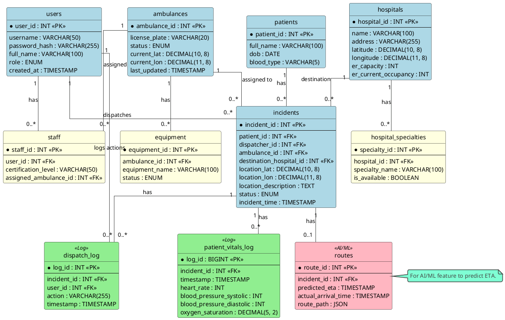

```plantuml
@startuml
!theme vibrant
hide circle
skinparam linetype ortho

' Define colors for entity groups
!define CORE_COLOR #LightBlue
!define LOG_COLOR #LightGreen
!define SUPPORT_COLOR #LightYellow
!define AI_COLOR #LightPink

entity "users" as users CORE_COLOR {
  * user_id : INT <<PK>>
  --
  username : VARCHAR(50)
  password_hash : VARCHAR(255)
  full_name : VARCHAR(100)
  role : ENUM
  created_at : TIMESTAMP
}

entity "ambulances" as ambulances CORE_COLOR {
  * ambulance_id : INT <<PK>>
  --
  license_plate : VARCHAR(20)
  status : ENUM
  current_lat : DECIMAL(10, 8)
  current_lon : DECIMAL(11, 8)
  last_updated : TIMESTAMP
}

entity "staff" as staff SUPPORT_COLOR {
  * staff_id : INT <<PK>>
  --
  user_id : INT <<FK>>
  certification_level : VARCHAR(50)
  assigned_ambulance_id : INT <<FK>>
}

entity "hospitals" as hospitals CORE_COLOR {
  * hospital_id : INT <<PK>>
  --
  name : VARCHAR(100)
  address : VARCHAR(255)
  latitude : DECIMAL(10, 8)
  longitude : DECIMAL(11, 8)
  er_capacity : INT
  er_current_occupancy : INT
}

entity "hospital_specialties" as hospital_specialties SUPPORT_COLOR {
  * specialty_id : INT <<PK>>
  --
  hospital_id : INT <<FK>>
  specialty_name : VARCHAR(100)
  is_available : BOOLEAN
}

entity "equipment" as equipment SUPPORT_COLOR {
  * equipment_id : INT <<PK>>
  --
  ambulance_id : INT <<FK>>
  equipment_name : VARCHAR(100)
  status : ENUM
}

entity "patients" as patients CORE_COLOR {
  * patient_id : INT <<PK>>
  --
  full_name : VARCHAR(100)
  dob : DATE
  blood_type : VARCHAR(5)
}

entity "incidents" as incidents CORE_COLOR {
  * incident_id : INT <<PK>>
  --
  patient_id : INT <<FK>>
  dispatcher_id : INT <<FK>>
  ambulance_id : INT <<FK>>
  destination_hospital_id : INT <<FK>>
  location_lat : DECIMAL(10, 8)
  location_lon : DECIMAL(11, 8)
  location_description : TEXT
  status : ENUM
  incident_time : TIMESTAMP
}

entity "patient_vitals_log" as patient_vitals_log <<Log>> LOG_COLOR {
  * log_id : BIGINT <<PK>>
  --
  incident_id : INT <<FK>>
  timestamp : TIMESTAMP
  heart_rate : INT
  blood_pressure_systolic : INT
  blood_pressure_diastolic : INT
  oxygen_saturation : DECIMAL(5, 2)
}

entity "routes" as routes <<AI/ML>> AI_COLOR {
  * route_id : INT <<PK>>
  --
  incident_id : INT <<FK>>
  predicted_eta : TIMESTAMP
  actual_arrival_time : TIMESTAMP
  route_path : JSON
}

entity "dispatch_log" as dispatch_log <<Log>> LOG_COLOR {
  * log_id : INT <<PK>>
  --
  incident_id : INT <<FK>>
  user_id : INT <<FK>>
  action : VARCHAR(255)
  timestamp : TIMESTAMP
}

' Relationships
users "1" -- "0..*" staff : "has"
ambulances "1" -- "0..*" staff : "assigned"
ambulances "1" -- "0..*" equipment : "has"
hospitals "1" -- "0..*" hospital_specialties : "has"
users "1" -- "0..*" incidents : "dispatches"
patients "1" -- "0..*" incidents : "has"
ambulances "1" -- "0..*" incidents : "assigned to"
hospitals "1" -- "0..*" incidents : "destination"
incidents "1" -- "0..*" patient_vitals_log : "has"
incidents "1" -- "0..1" routes : "has"
incidents "1" -- "0..*" dispatch_log : "has"
users "1" -- "0..*" dispatch_log : "logs actions"

note right of routes: For AI/ML feature to predict ETA.

@enduml
```